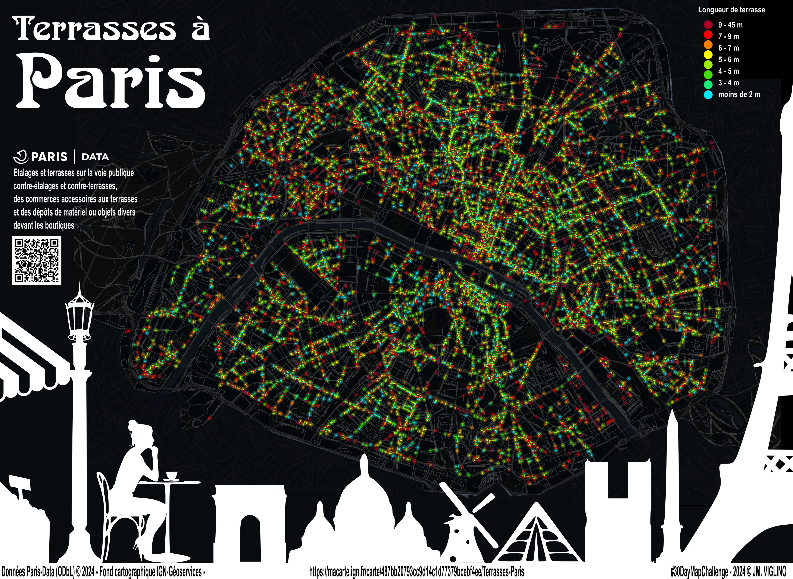

# Day 1 - Points

Pour ce premier jour, une carte des terrasses à Paris avec les données de [Paris | Data](https://opendata.paris.fr/explore/dataset/terrasses-autorisations/information/?disjunctive.typologie&disjunctive.arrondissement). La carte a été réalisée avec [Ma carte](https://macarte.ign.fr/)
Le poster a été réalisé avec Inkscape pour habiller la carte et lui ajouter un titre et une illustration.

{: .center }
{:width="550px"}{: .fullscreen }    
[Voir la carte en ligne](https://macarte.ign.fr/carte/487bb20793cc9d14c1d77379bcebf4ee/Terrasses-Paris){:target="macarte"}

{: .center }
[{:width="40px"}](https://x.com/jmviglino/status/1852275585684218327)
