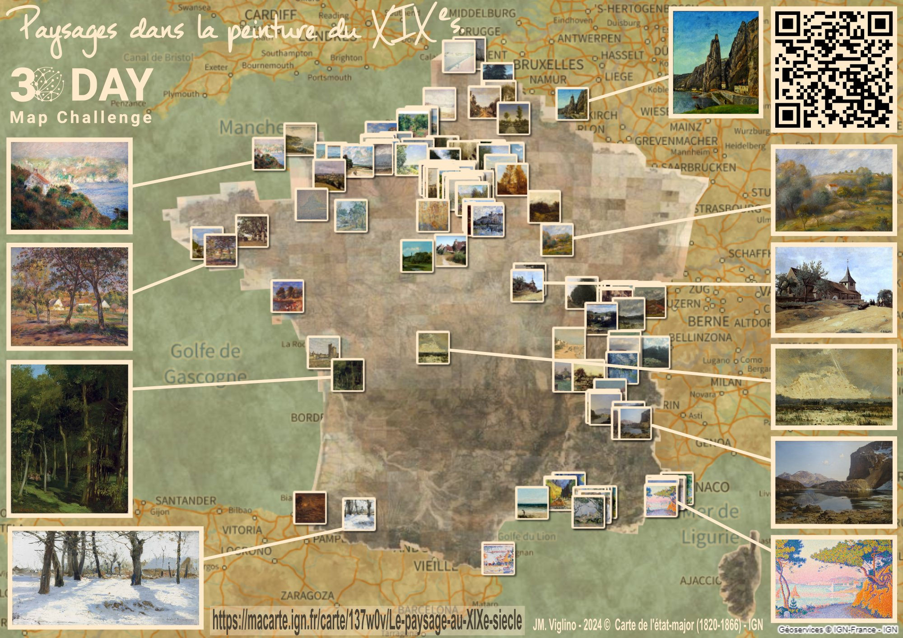

# Day 10 - Pen & paper 

Pour la journée du papier-crayon, j'ai choisi de faire une carte de France localisant des tableaux de paysage au XIXème, disponible sur [Ma carte](https://macarte.ign.fr/) et sous forme de poster.

{: .center }
{:width="550px"}{: .fullscreen }    
[Voir la carte en ligne](https://macarte.ign.fr/carte/137w0v/Le-paysage-au-XIXe-siecle){:target="macarte"}

{: .center }
[{:width="40px"}](https://x.com/jmviglino/status/1855508744836124948) - [{:width="40px"}](https://mapstodon.space/@jmviglino/113475643219225295) - [{:width="40px"}](https://bsky.app/profile/canfre.bsky.social/post/3lampq4dlp22l)
