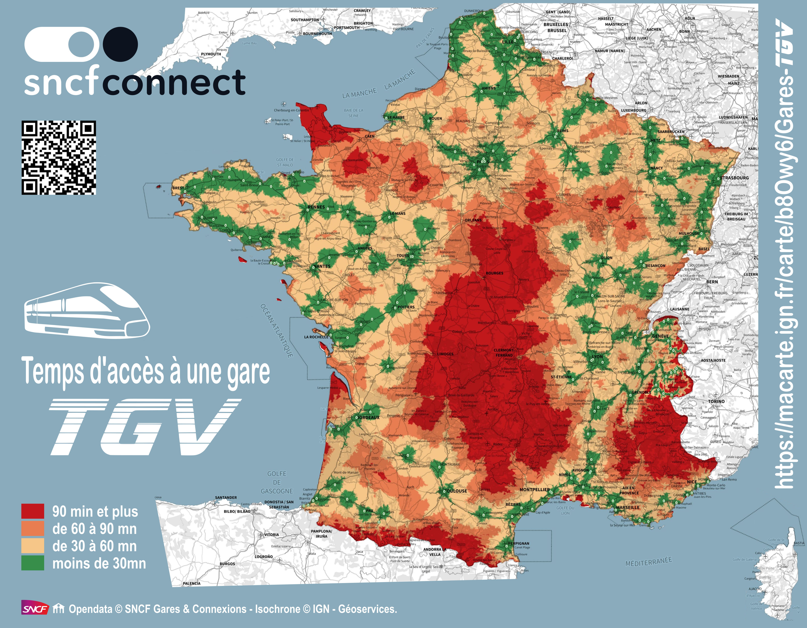

# Day 12 - Time & space 

Pour le jour 12, une nouvelle carte faite pour le compte [@IGNFrance](https://x.com/IGNFrance) sur le temps d'accès à une gare TGV, en utilisant le service d'isochrone de la [Géoplateforme](https://geoservices.ign.fr/services-geoplateforme-itineraire).   
Librement inspiré de la carte de [@BorisMercskay](https://x.com/BorisMericskay/status/1846140847701569602).

{: .center }
{:width="550px"}{: .fullscreen }    
[Voir la carte en ligne](https://macarte.ign.fr/carte/b8Owy6/Gares-TGV){:target="macarte"}

{: .center }
[{:width="40px"}](https://x.com/IGNFrance/status/1856259236470169624) - [{:width="40px"}](https://mapstodon.space/@CanFre@mamot.fr/113469160057914518)
