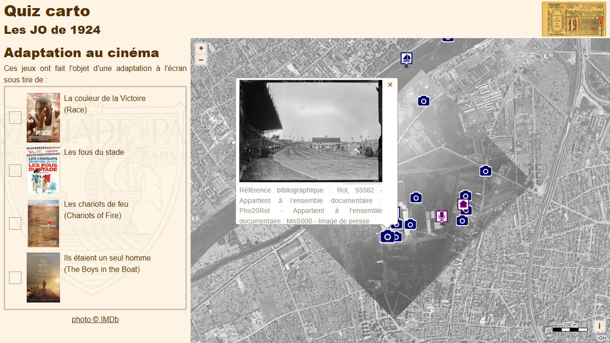

# Day 13 - New tool

Un nouvel outil en cours de test sur [Ma carte](https://macarte.ign.fr/) permet de réaliser des QCM sur une carte et réaliser des Quiz géographiques. C'est l'occasion de le tester pour le jour 13 "nouvel outil" !

{: .center }
{:width="550px"}{: .fullscreen }    
[Voir la carte en ligne](https://macarte.ign.fr/carte/lF9pjX/Quiz-JO-1924){:target="macarte"}

{: .center }
[{:width="40px"}](https://x.com/jmviglino/status/1856613562036191415) - [{:width="40px"}](https://mapstodon.space/deck/@jmviglino/113475736641023227)
