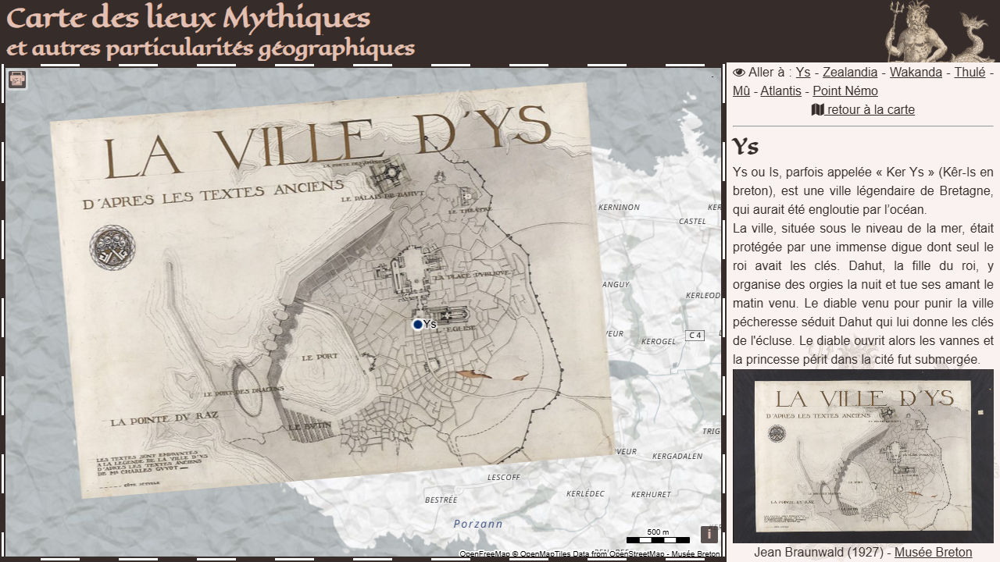

# Day 14 - A World Map

Une carte du monde des lieux Mythiques que j'avait commencé il y a quelques temps et qui regroupe des lieux mythiques réels (Zealandia) ou imaginaire (Atlantis, Thulé) ou des particularités géographiques (point Némo, ligne Wallace).

{: .center }
{:width="550px"}{: .fullscreen }    
[Voir la carte en ligne](https://macarte.ign.fr/carte/n9gf4d/Carte-des-lieux-Mythiques){:target="macarte"}

{: .center }
[{:width="40px"}](https://x.com/jmviglino/status/1856978100329861433) - [{:width="40px"}](https://mapstodon.space/deck/@jmviglino/113480898163763886)
