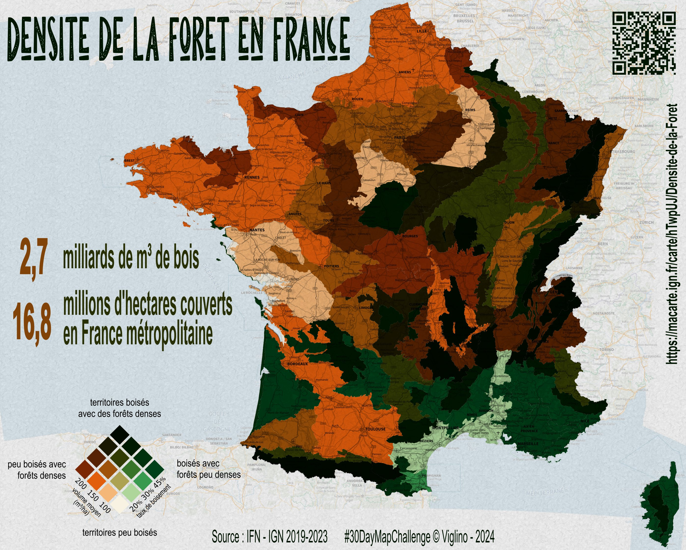

# Day 16 - Choropleth

Un carte bivariée avec les donnée de l'Institut forestier, façon tableau de bord.

{: .center }
{:width="550px"}{: .fullscreen }    
[Voir la carte en ligne](https://macarte.ign.fr/carte/hTwpUJ/Densite-de-la-Foret){:target="macarte"}

{: .center }
[{:width="40px"}](https://x.com/jmviglino/status/1857681005257113957) - [{:width="40px"}](https://mapstodon.space/deck/@jmviglino/113496903296267015) - [{:width="40px"}](https://bsky.app/profile/canfre.bsky.social/post/3lb2nct54xc2p)

