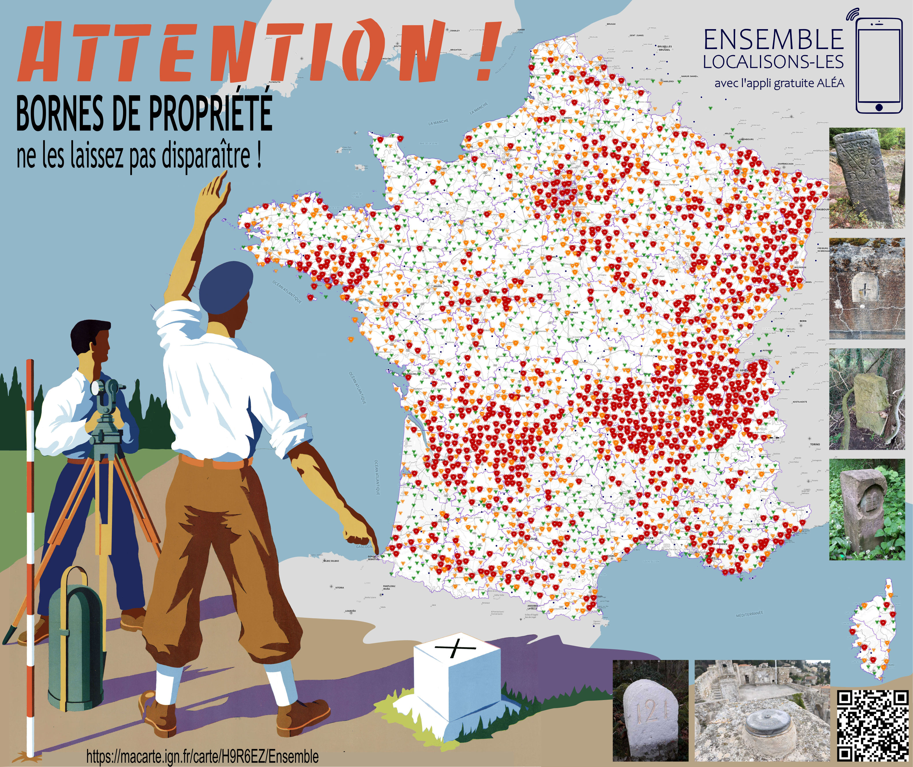

# Day 17 - Collaborative - IGN

Une carte représentant les remontées collaborative de l'IGN au travers de l'outil Aléa et de l'espace collaboratif.

{: .center }
{:width="550px"}{: .fullscreen }    
[Voir la carte en ligne](https://macarte.ign.fr/carte/H9R6EZ/Ensemble){:target="macarte"}

{: .center }
[{:width="40px"}](https://x.com/IGNFrance/status/1858038611318346043) - [{:width="40px"}](https://mapstodon.space/@ignfrance@social.numerique.gouv.fr/113497780695302128) - [{:width="40px"}](https://bsky.app/profile/canfre.bsky.social/post/3lb4wrfive22v)
