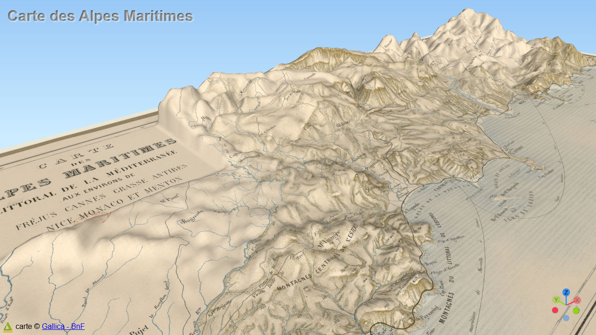

# Day 18 - 3D

Une carte de Gallica en 3D avec QGis.

{: .center }
{:width="550px"}{: .fullscreen }    
[Voir la carte en ligne](https://viglino.github.io/maps/static/gallica-carte-frejus-antibe.html){:target="macarte"}

{: .center }
[{:width="40px"}](https://x.com/jmviglino/status/1858406032818455036) - [{:width="40px"}](https://mapstodon.space/deck/@jmviglino/113502935932804455)
