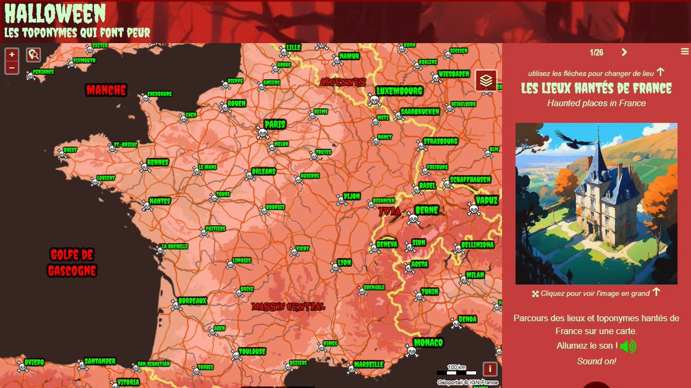

# Day 19 - Typography

Pour le 19ème jour, j'ai repris une carte faite pour Halloween qui recense des noms avec une consonance horrifique sur les carte IGN. Les illustrations ont étés générées par une IA et les son proviennent de FreeSound project.

{: .center }
{:width="550px"}{: .fullscreen }    
[Voir la carte en ligne](https://macarte.ign.fr/carte/XDoKXw/Halloween-Special){:target="macarte"}

{: .center }
[{:width="40px"}](https://x.com/jmviglino/status/1858770433702850872) - [{:width="40px"}](https://mapstodon.space/deck/@jmviglino/113509706825976571) - [{:width="40px"}](https://bsky.app/profile/jmviglino.bsky.social/post/3lbcpaa7kcu2k)
