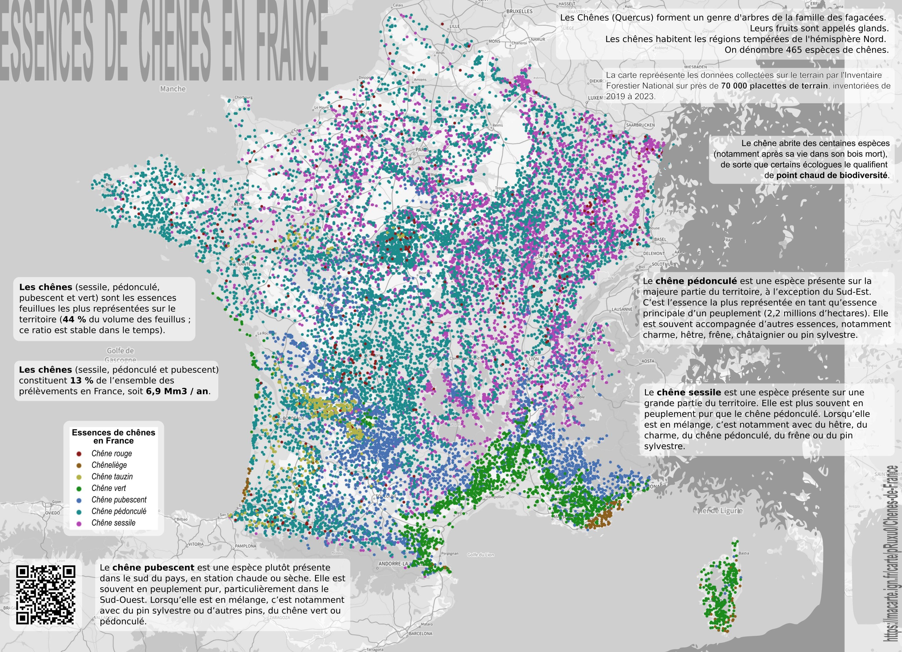

# Day 1 - Points -IGN

Une affiche faite pour publication sur le compte d'[@IGNFrance](https://x.com/IGNFrance) avec pour thème la répartition des chênes en France, utilisant les données de l'[Inventaire forestier](https://inventaire-forestier.ign.fr/dataifn/DonneesBrute).   
Avec un poster et une carte en ligne sur [Ma carte](https://macarte.ign.fr/).

{: .center }
{:width="550px"}{: .fullscreen }    
[Voir la carte en ligne](https://macarte.ign.fr/carte/xg5pFn/Les-chenes-en-France){:target="macarte"}

{: .center }
[{:width="40px"}](https://x.com/IGNFrance/status/1852236632134685156) - [{:width="40px"}](https://mapstodon.space/deck/@CanFre@mamot.fr/113407065144162540)
