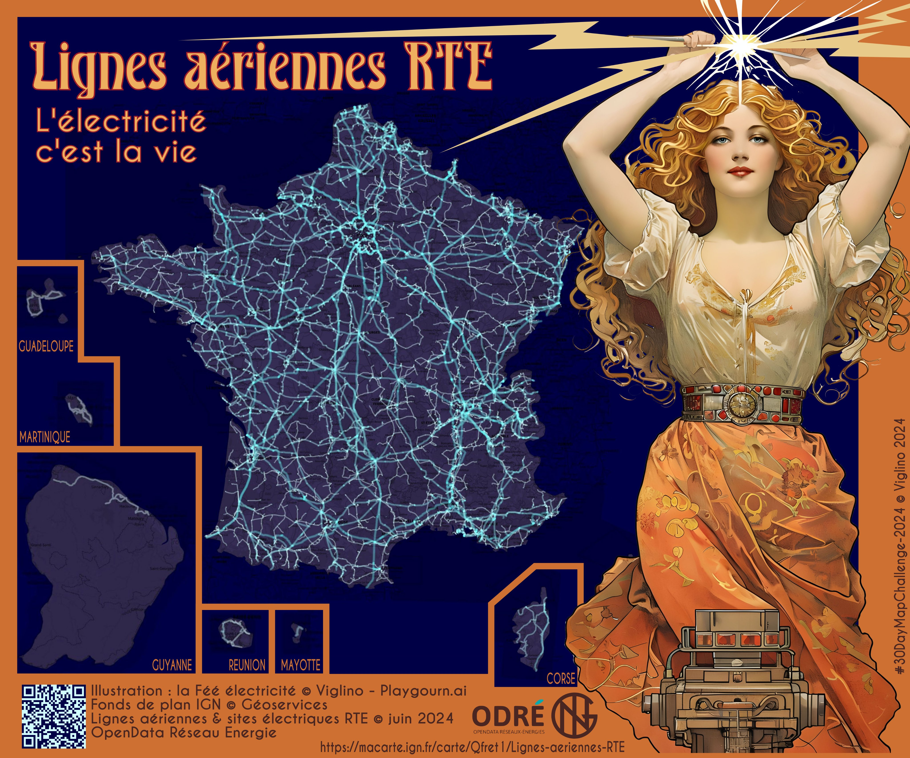
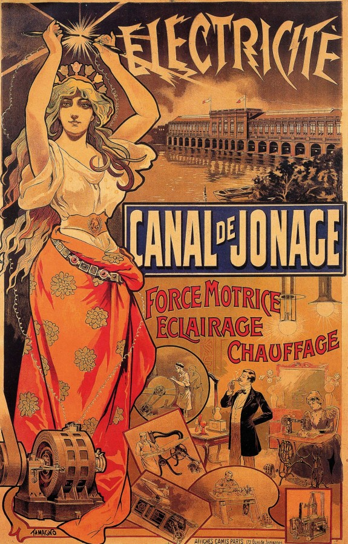

# Day 2 - Lines

Une carte des lignes électrique qui s'inspire de l'affiche "La fée électricité" publiée sur le site des [archives de Villeurbanne](http://lerizeplus.villeurbanne.fr/article.php?laref=321&titre=la-fee-electricite) dans un style *Art Nouveau*.   
La carte a été réalisée avec [Ma carte](https://macarte.ign.fr/) et l'image de la fée réalisée par une [intelligence artificielle sur Playground](https://playground.com/post/a-vintage-art-nouveau-poster-figuring-electric-power-featur-cm1xfjbmr03yl10pg9wv03w0k), le tout mis en forme sur Inkscape.

{: .center }
{:width="550px"}{: .fullscreen }    
[Voir la carte en ligne](https://macarte.ign.fr/carte/Qfret1/Lignes-aeriennes-RTE){:target="macarte"}

{: .center }
{:width="550px"}{: .fullscreen }    
[Affiche la fée électricité &copy; Le Rize+](http://lerizeplus.villeurbanne.fr/article.php?laref=321&titre=la-fee-electricite){:target="macarte"}

{: .center }
[{:width="40px"}](https://x.com/jmviglino/status/1852631682878156910) - [{:width="40px"}](https://mapstodon.space/deck/@jmviglino/113412525113275473)
