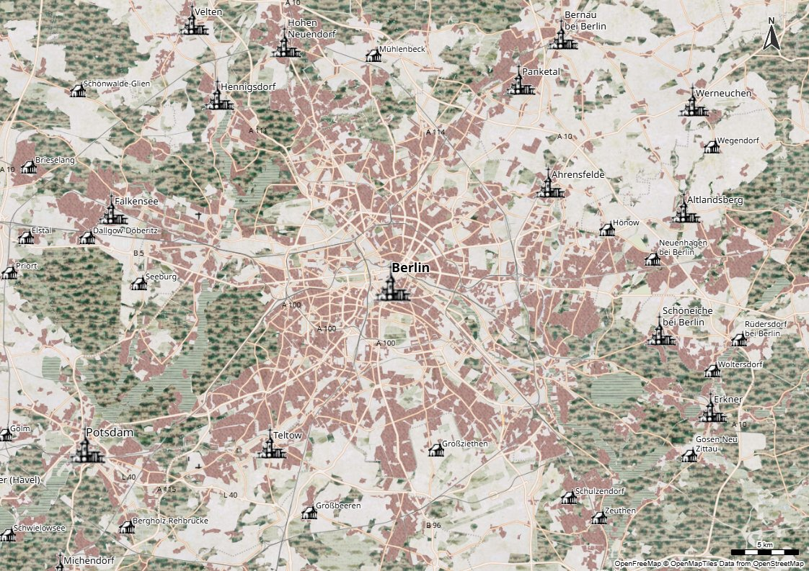

# Day 20 - Openstreetmap 

Sur le thème Openstreetmap, je propose un style façon carte ancienne de "Cassini" pour les données OSM, diffusées par le projet [OpenFreeMap](https://openfreemap.org/).

{: .center }
{:width="550px"}{: .fullscreen }    
[Voir la carte en ligne](https://macarte.ign.fr/carte/0jFLuT/OpenFreeCassini){:target="macarte"}

{: .center }
[{:width="40px"}](https://x.com/jmviglino/status/1859133073344131252) - [{:width="40px"}](https://mapstodon.space/deck/@jmviglino/113514863923014624) - [{:width="40px"}](https://bsky.app/profile/jmviglino.bsky.social/post/3lbel23rlik2s)
