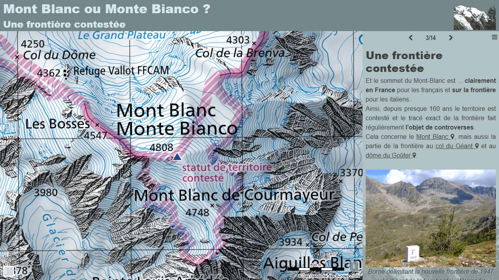

# Day 21 - Conflict 

Vous pensez que le mont Blanc est en France ? Pa si sûr...   
Une petite histoire de conflit frontalier sur des cartes de l'IGN (Fance), de l'IGM (Italie), de SwissTopo (Suisse) et de Gallica-BnF (avec l'expertise du CNIG).

{: .center }
{:width="550px"}{: .fullscreen }    
[Voir la carte en ligne](https://macarte.ign.fr/carte/mctfGY/Mont-Blanc-ou-Monte-Bianco){:target="macarte"}

{: .center }
[{:width="40px"}](https://x.com/jmviglino/status/1859495712549183633) - [{:width="40px"}](https://mapstodon.space/deck/@jmviglino/113519811774956416) - [{:width="40px"}](https://bsky.app/profile/jmviglino.bsky.social/post/3lbgxfeqzek2z) - [{:width="40px"}](https://www.linkedin.com/feed/update/urn:li:activity:7265278456278433792/)

