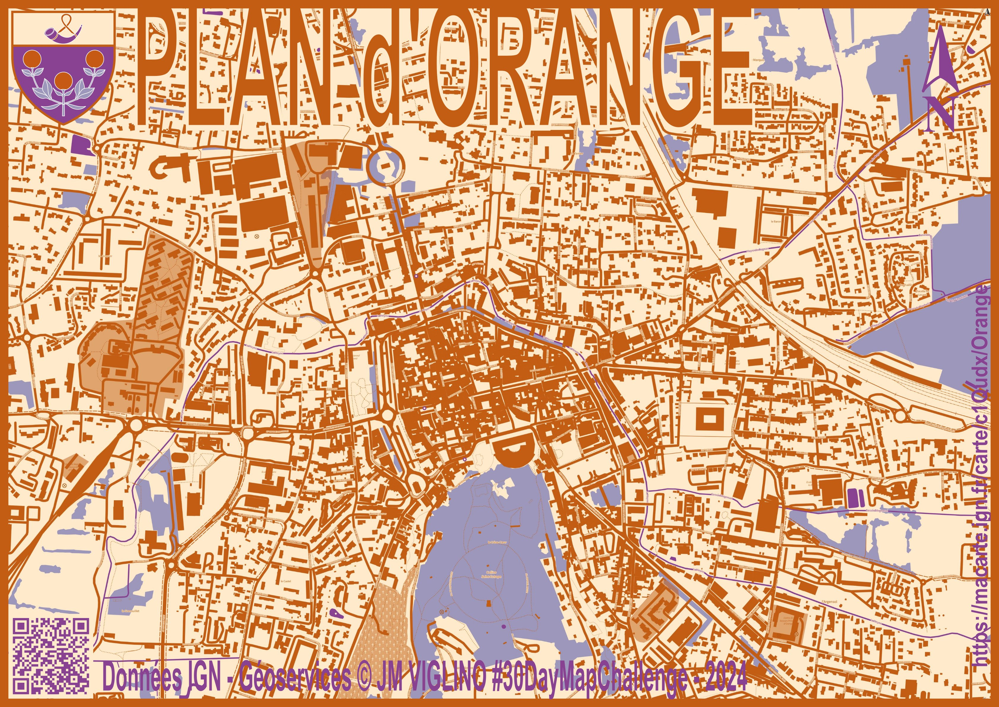

# Day 22 - 2 colours

Un carte orange (et bleue) de la ville d'Orange (parce qu'une orange, c'est orange ou bleu).

{: .center }
{:width="550px"}{: .fullscreen }    
[Voir la carte en ligne](https://macarte.ign.fr/carte/mctfGY/Mont-Blanc-ou-Monte-Bianco){:target="macarte"}

{: .center }
[{:width="40px"}](https://x.com/jmviglino/status/1859856842379211052) - [{:width="40px"}](https://mapstodon.space/deck/@jmviglino/113525621486533444) - [{:width="40px"}](https://bsky.app/profile/did:plc:dhkzuubapdaekmh6twharwqu/post/3lbjjr4tr4k27) - [{:width="40px"}](https://www.linkedin.com/feed/update/urn:li:activity:7265761244450631680/)