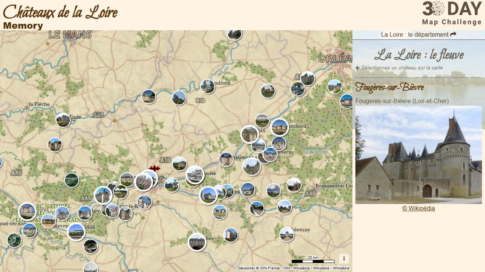

# Day 23 -  Memory

Ma mémoire me joue des tours... qu'entend-on par "châteaux de la Loire" ?   
Une petite carte rapide des châteaux sur la Loire et dans le département de la Loire avec le style "[guide book](https://github.com/Viglino/geoservice-style?tab=readme-ov-file#guide-book)" des tuiles vectorielles de l'IGN. 

{: .center }
{:width="550px"}{: .fullscreen }    
[Voir la carte en ligne](https://macarte.ign.fr/carte/EHRkBj/Chateaux-de-la-Loire){:target="macarte"}

{: .center }
[{:width="40px"}](https://x.com/jmviglino/status/1860220991567512033) - [{:width="40px"}](https://mapstodon.space/deck/@jmviglino/113531134433249179) - [{:width="40px"}](https://bsky.app/profile/did:plc:dhkzuubapdaekmh6twharwqu/post/3lblyfoci4c2h) - [{:width="40px"}](https://www.linkedin.com/feed/update/urn:li:activity:7265994222435028992/)
