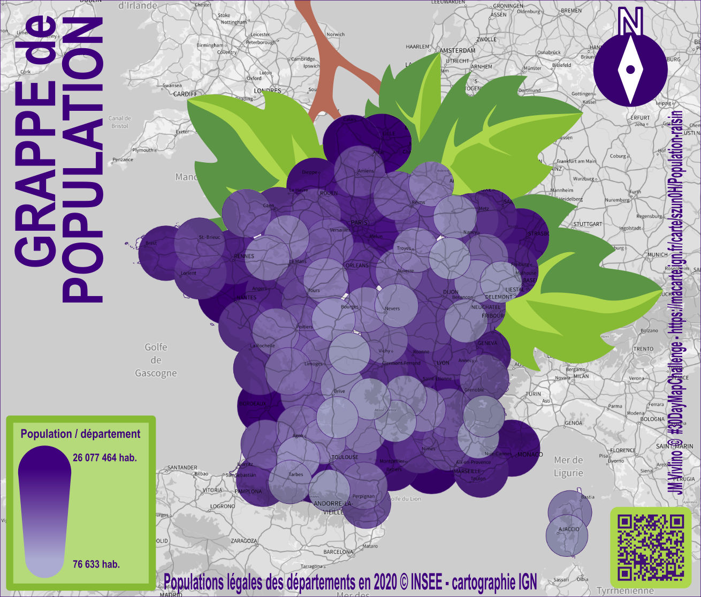

# Day 24 - Only circular shapes

Une carte de France sous forme de grappe de raisin.

{: .center }
{:width="550px"}{: .fullscreen }    
[Voir la carte en ligne](https://macarte.ign.fr/carte/szun0H/Population-raisin){:target="macarte"}

{: .center }
[{:width="40px"}](https://x.com/jmviglino/status/1860587154507980951) - [{:width="40px"}](https://mapstodon.space/deck/@jmviglino/113536798426889171) - [{:width="40px"}](https://bsky.app/profile/did:plc:dhkzuubapdaekmh6twharwqu/post/3lboinznkv22o) - [{:width="40px"}](https://www.linkedin.com/feed/update/urn:li:activity:7266354851683471360/)
