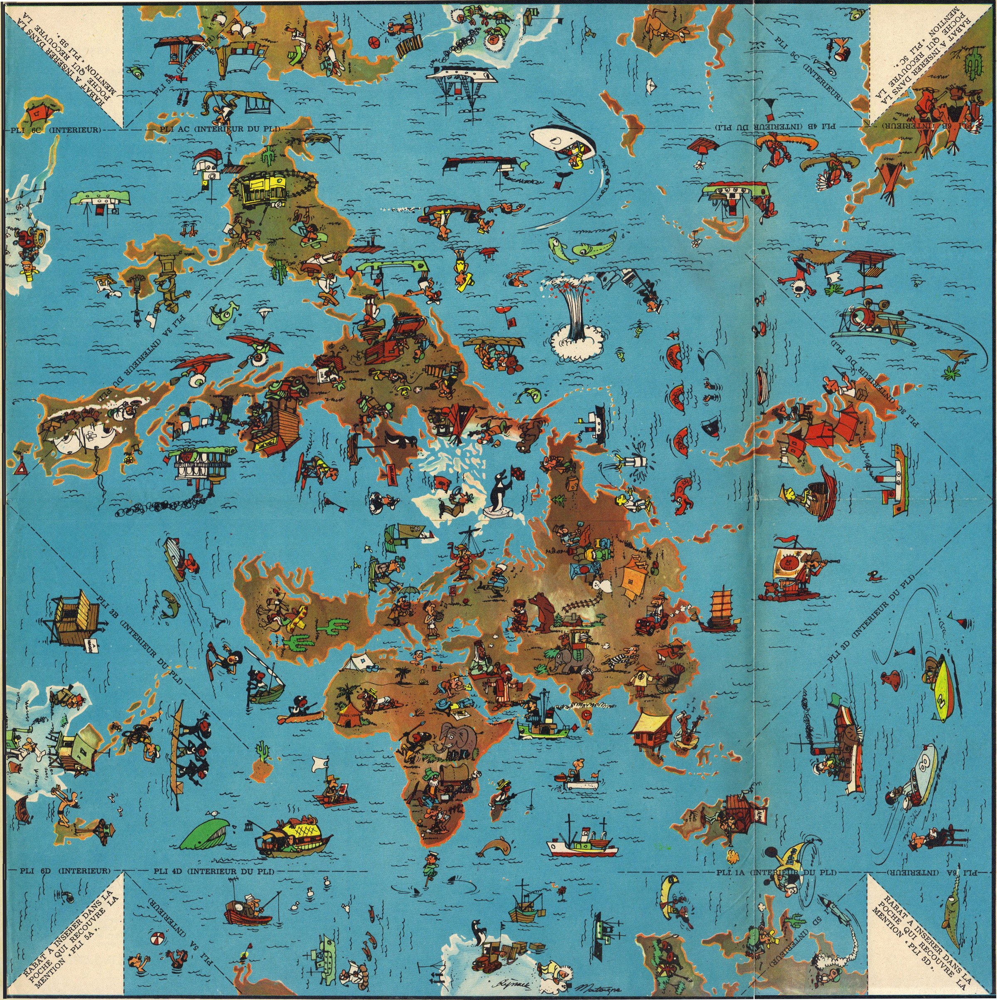
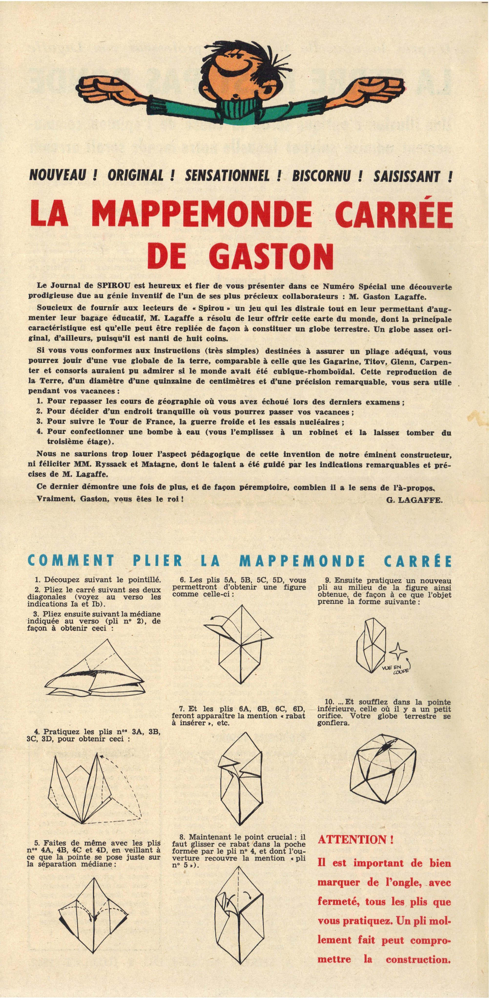

# Day 26 - Projections

Une carte de France sous forme de grappe de raisin.

{: .center }
{:width="550px"}{: .fullscreen }    
{:width="400px"}{: .fullscreen }    

{: .center }
[{:width="40px"}](https://x.com/jmviglino/status/1861304632267440488) - [{:width="40px"}](https://mapstodon.space/deck/@jmviglino/113548103727883340) - [{:width="40px"}](https://bsky.app/profile/jmviglino.bsky.social/post/3lbtjckw7xk2g) - [{:width="40px"}](https://www.linkedin.com/feed/update/urn:li:activity:7267078124083851264/)
