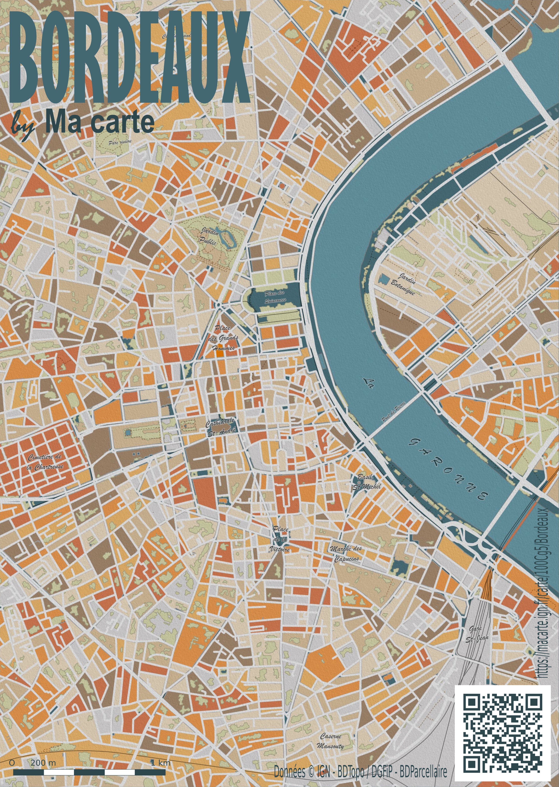

# Day 3 - Polygons

Pour le jour 3, un poster de Bordeaux, avec le parcellaire cadastral aux couleurs d'automne, utilisant les données de la BDParcellaire.

{: .center }
{:width="550px"}{: .fullscreen }    
[Voir la carte en ligne](https://macarte.ign.fr/carte/100Cg5/Plan-poster-de-Bordeaux){:target="macarte"}

{: .center }
[{:width="40px"}](https://x.com/jmviglino/status/1852978438644146365) - [{:width="40px"}](https://mapstodon.space/deck/@jmviglino/113418779215746037)
