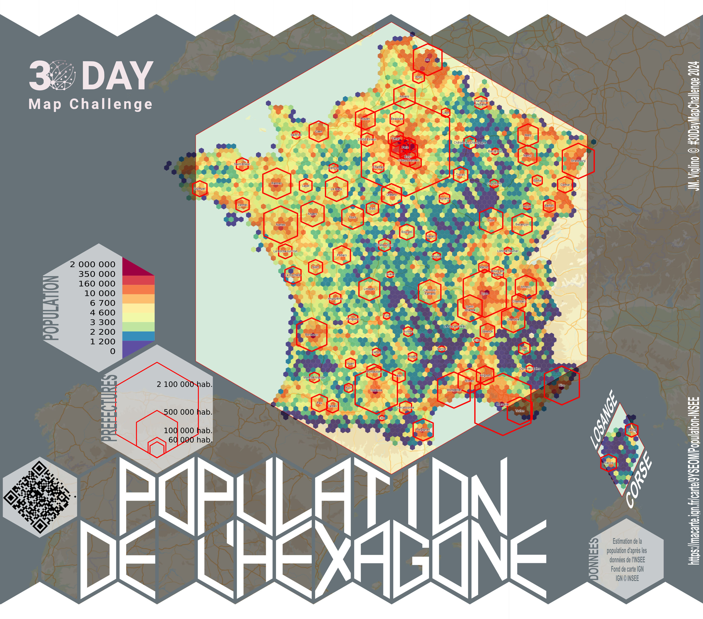

# Day 4 - Hexagons

Et une carte de la population (source INSEE) de l'hexagone, sous forme d'hexagones (et d'un losange pour la Corse).

{: .center }
{:width="550px"}{: .fullscreen }    
[Voir la carte en ligne](https://macarte.ign.fr/carte/9YSEOM/Population){:target="macarte"}

{: .center }
[{:width="40px"}](https://x.com/jmviglino/status/1853343015651233897) - [{:width="40px"}](https://mapstodon.space/deck/@jmviglino/113423559022950445)
