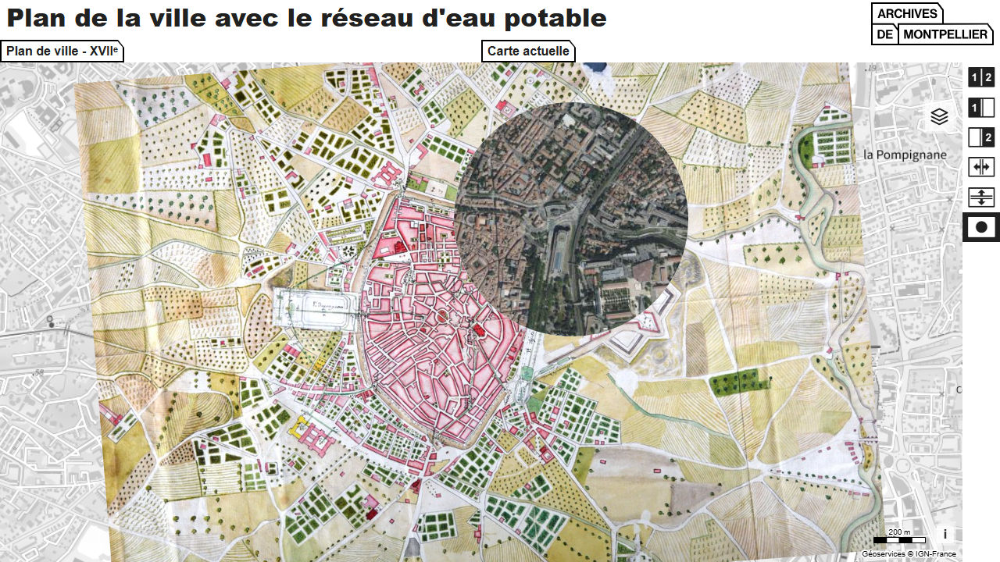

# Day 6 - Raster

Pour le jour 6, j'ai utilisé une carte des archives de Montpellier ([@ArchivesMtp34](https://x.com/ArchivesMtp34) qui participe aussi au 30DayMapChallenge) pour comparer la carte avec l'orthophotographie de l'IGN

{: .center }
{:width="550px"}{: .fullscreen }    
[Voir la carte en ligne](https://macarte.ign.fr/carte/Seaakw/Archives-Montpellier){:target="macarte"}

{: .center }
[{:width="40px"}](https://x.com/jmviglino/status/1854079985272643624) - [{:width="40px"}](https://mapstodon.space/deck/@jmviglino/113435106326300460) - [{:width="40px"}](https://bsky.app/profile/canfre.bsky.social/post/3labqsk3ogl2d)
