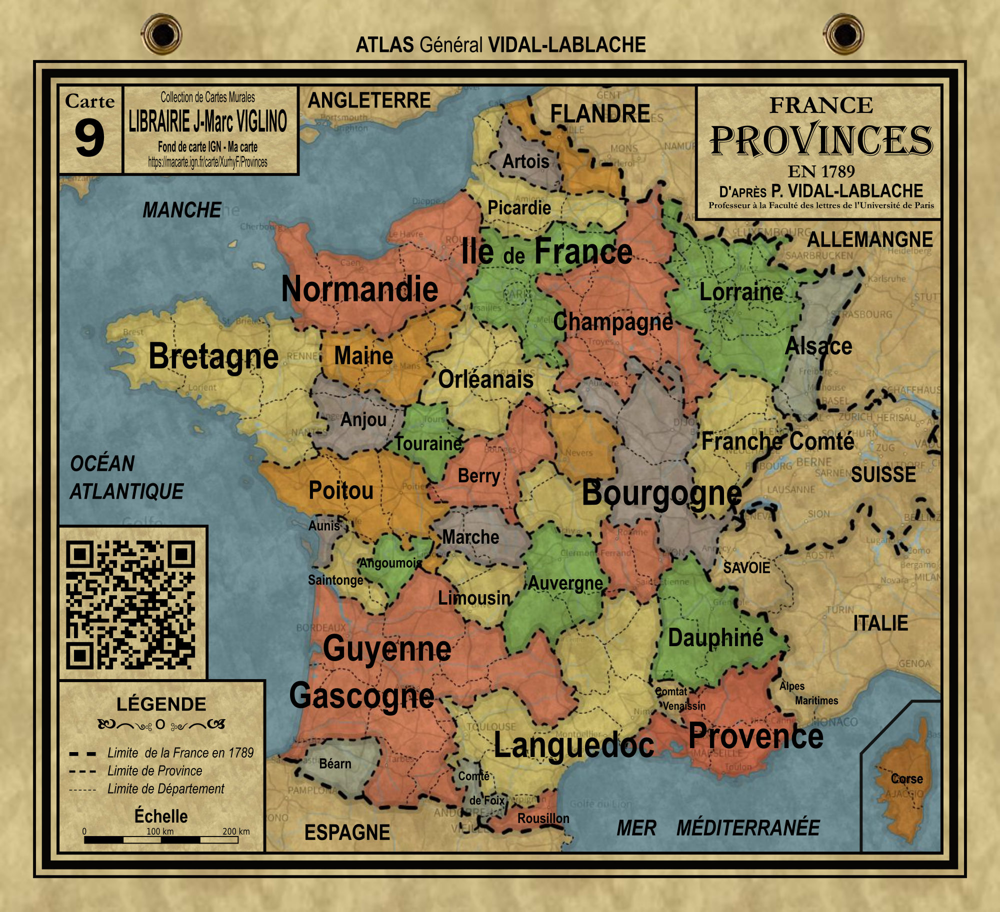

# Day 7 - Vintage

Quoi de plus "vintage" qu'une bonne vielle carte Vidal-Lablache ?   
J'ai donc repris la carte des provinces avant 1789 publiée par le célèbre éditeur pour en faire une carte en ligne avec [Ma carte](https://macarte.ign.fr/) et un poster pour la salle de classe.

{: .center }
{:width="550px"}{: .fullscreen }    
[Voir la carte en ligne](https://macarte.ign.fr/carte/Af9Q49/France-PROVINCES-en-1789){:target="macarte"}

{: .center }
[{:width="40px"}](https://x.com/jmviglino/status/1854429092965196083) - [{:width="40px"}](https://mapstodon.space/deck/@jmviglino/113435106326300460)
