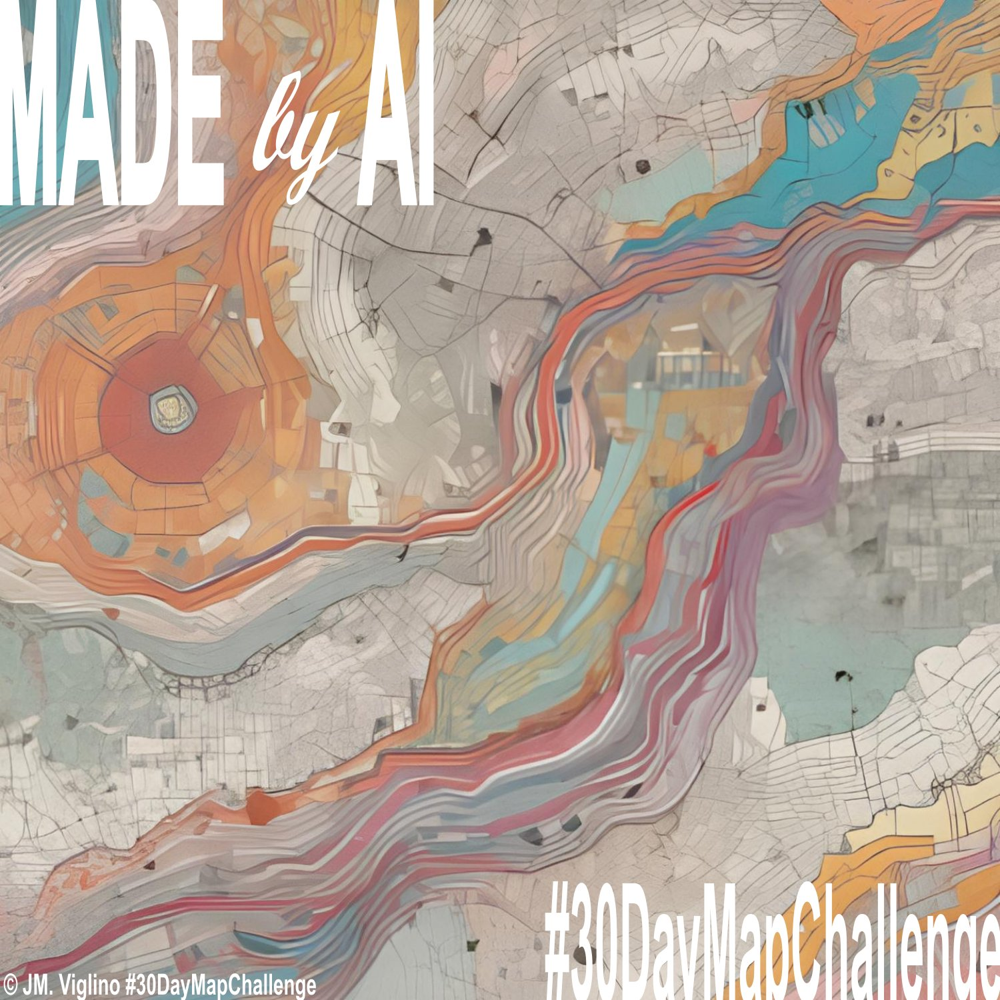
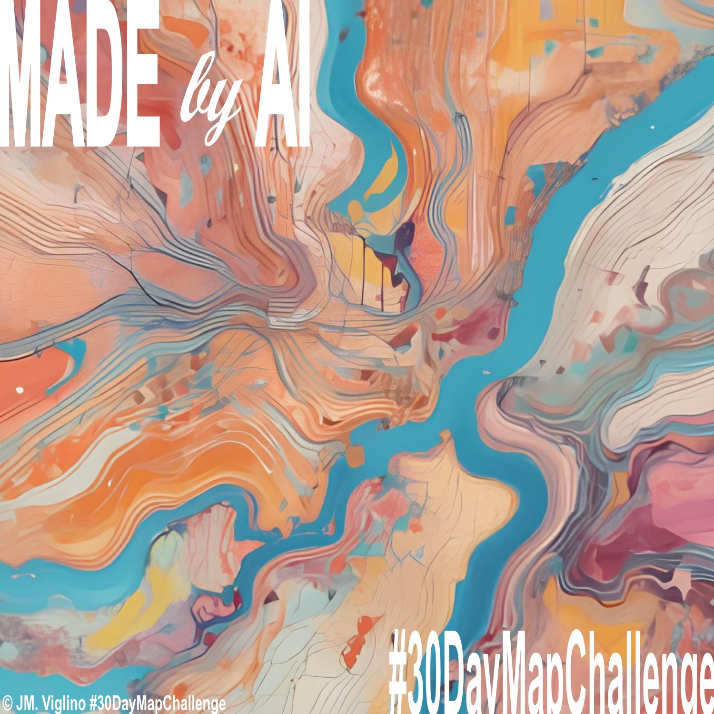
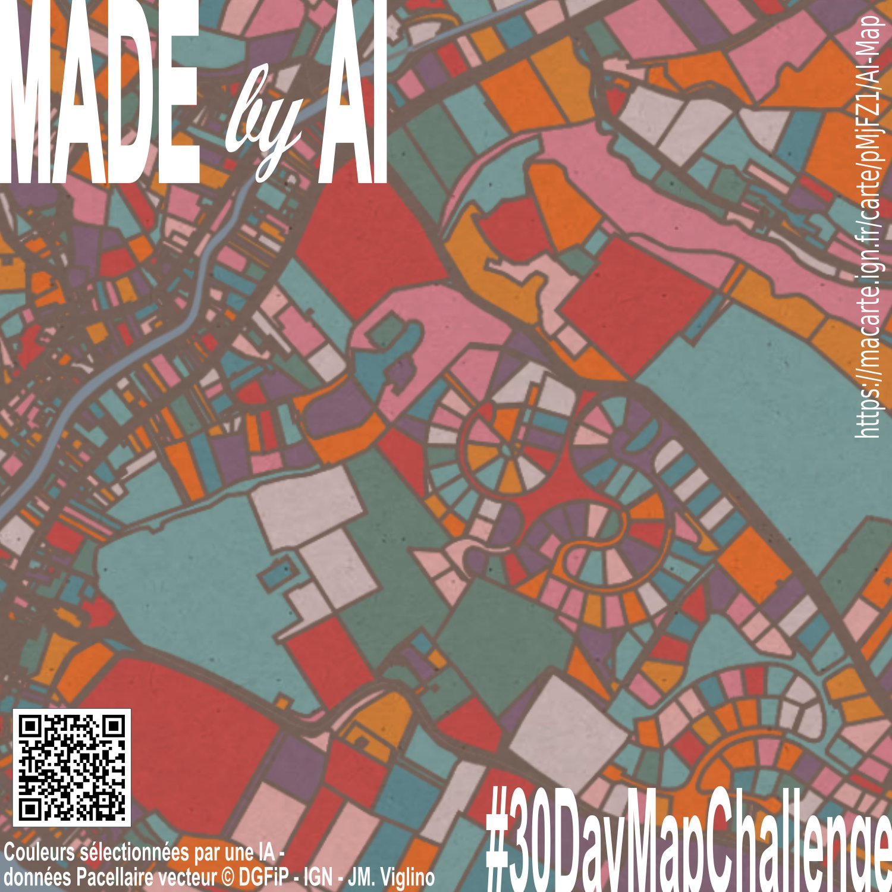
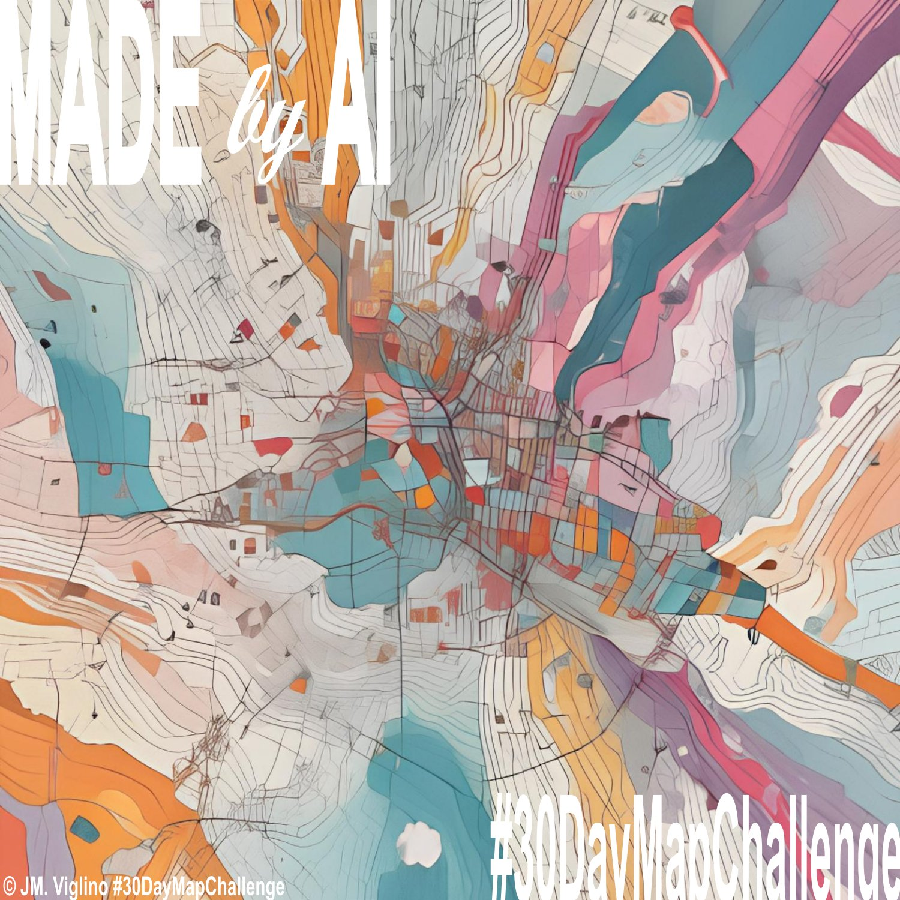

# Day 9 - AI only

Un ensemble de carte faite par une Intelligence Artificielle qui , je trouve, ont un rendu assez cartographique (avec courbe de niveau, route et rivières), auxquels j'ai ajouté une carte utilisant les flux de la Géoplateforme de l'IGN qui reprend les couleurs proposées par l'IA.

{: .center }
{:width="550px"}{: .fullscreen }    
{:width="550px"}{: .fullscreen }    
{:width="550px"}{: .fullscreen }    
{:width="550px"}{: .fullscreen }    
[Voir la carte en ligne](https://macarte.ign.fr/carte/pMjFZ1/AI-Map){:target="macarte"}

{: .center }
[{:width="40px"}](https://x.com/jmviglino/status/1855145842178449430) - [{:width="40px"}](https://mapstodon.space/deck/@jmviglino/113475606755603497)
