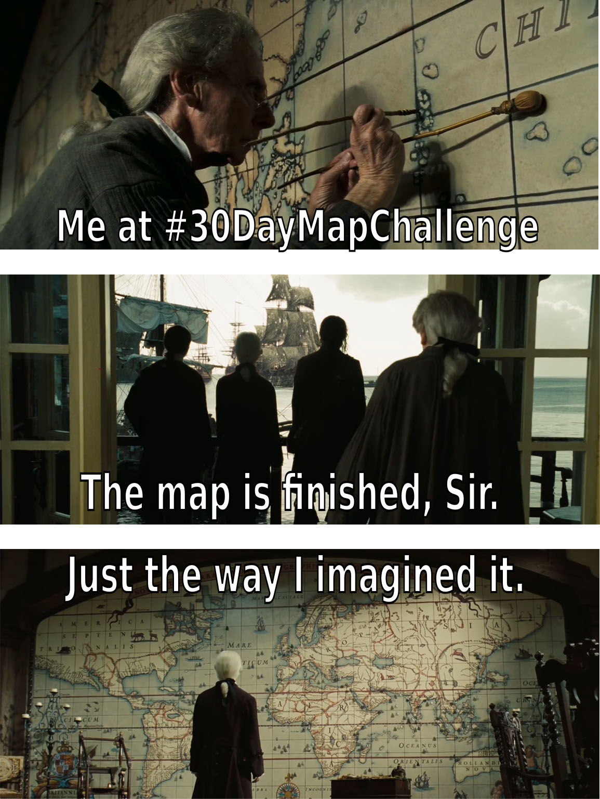

# My #30DayMapChallenge 2024

Le #30DayMapChallenge est un défi lancé en 2019 par [Topi Tjukanov](https://tjukanov.org/), un cartographe Finlandais. Cela consiste à publier chaque jour une carte sur une thématique imposée.

{: .note }
Pour suivre le challenge, cherchez le hastag `#30DayMapChallenge` sur les réseaux sociaux.
Un site internet recense également toutes les informations sur ce challenge : [30daymapchallenge.com](https://30daymapchallenge.com/)

<iframe width="560" height="315" src="https://youtu.be/J2PWTkMakvM?si=V0pne4FfFkJsDB2-" title="YouTube video player" frameborder="0" allow="accelerometer; autoplay; clipboard-write; encrypted-media; gyroscope; picture-in-picture; web-share" referrerpolicy="strict-origin-when-cross-origin" allowfullscreen style="margin: auto"></iframe>
